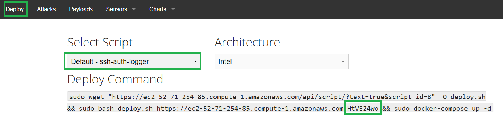

# Arculus Drone Testbed Setup Guide

This documentation primarily focuses on setting up the Arculus Drone Testbed. Setting up the Community Honey Network (CHN) server is optional and provided for users who need to deploy and monitor honeypots.

## CHN Server Setup (Optional)
The CHN server offers functionalities to deploy, undeploy honeypots, and monitor attacker activities.

### Installation Steps

1. **Update System Packages**
   ```bash
   sudo apt-get update
   ```
   
2. **Install Required Packages**
   ```bash
   sudo apt-get install -y python3-validators docker.io docker-compose
   ```
   
3. **Clone the CHN Server Repository**
   ```bash
   sudo mkdir -p /opt && sudo git clone https://github.com/CommunityHoneyNetwork/chn-quickstart.git /opt/chnserver
   ```
   
4. **Enter the Quickstart Directory**
   ```bash
   cd /opt/chnserver
   ```
   
5. **Run the Quickstart Process**
   ```bash
   sudo ./guided_docker_compose.py
   ```
   - 
   - 
   - 
   - 

### Starting the CHN Server
   ```bash
   docker-compose up -d
   ```

### Accessing the CHN Server

- **Retrieve Credentials**
  ```bash
  grep SUPERUSER /opt/chnserver/config/sysconfig/chnserver.env
  ```
  

- **Login to CHN Server Dashboard**
  Visit the public domain of the CHN Server on a browser and use the credentials to login.
  

- **Retrieve API Key**
  Go to the settings page of the CHN Server to retrieve the API Key.
  

- **Retrieve Deploy Key**
  Go to the "Deploy" tab of the CHN Server and choose a honeypot type for the dashboard to display a sample script. Fetch the deploy key as shown in the screenshot below:
  

### Additional Resources
For detailed steps on each part of the CHN Server Setup process, visit:
https://communityhoneynetwork.readthedocs.io/en/stable/serverinstall/

## Arculus Drone Testbed Setup

On a different machine designated to host the Arculus server, navigate to the Arculus repository's root directory.

1. **Setup Script**
   ```bash
   sudo chmod +x arculus-setup.sh
   ./arculus-setup.sh
   ```

### Video Tutorial
For a detailed video demonstration on setting up Arculus, visit:
https://www.youtube.com/watch?v=Pfk5QcVTnfo&list=PLuMWNW0dmynnA_J2aOPV3Wc_USlg1xDss&index=5&t=5s
